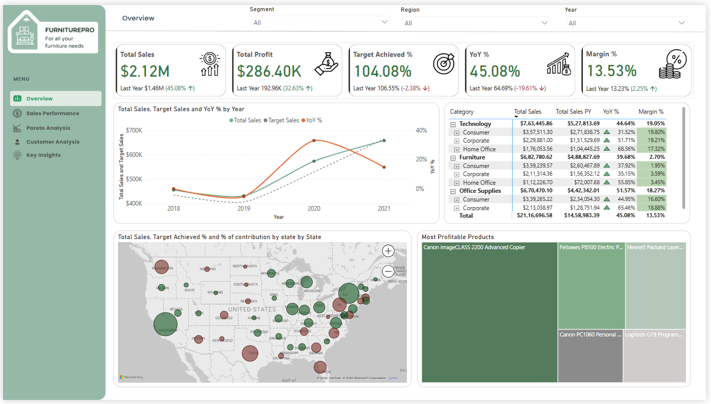

# 🪑 FurniturePro & Co. Sales and Customer Analysis – Power BI Case Study

This project is a comprehensive Power BI case study for **FurniturePro & Co., Retailers**, a leading retail chain seeking enhanced insights into its sales and customer operations. The dashboard empowers stakeholders with actionable intelligence across sales trends, customer behavior, and profitability.

> 📝 *I encountered this case study as part of an interview process with **BCG (Boston Consulting Group)**. The challenge offered a great opportunity to demonstrate practical Power BI skills in a real-world business scenario.*

---

## 📌 Problem Statement

FurniturePro & Co. is looking to:

- Understand monthly, quarterly, and YoY sales performance
- Identify top and underperforming segments, categories, and regions
- Investigate high product return rates and their patterns
- Perform predictive analysis using What-If scenarios for discount strategy
- Analyze sales contribution using Pareto principle
- Deep dive into customer behavior using RFM segmentation
- Identify new customers and segment-wise top-performing salespersons

---

## 📈 Key Performance Indicators (KPIs)

-  **Total Sales** 
- **% Target Achieved**
- **% Margin** 
- **Return Rate by Product, Region, and Category**
- **YoY Growth %**
- **Predicted Profit (via What-If Analysis)**

---

## 🖥️ Dashboard Views

This Power BI report is structured into **five interactive dashboards**, each serving a unique analytical purpose:

### 1. 📋 Overview
A high-level summary of the company's overall sales and customer performance, including key KPIs like total sales, % target achieved, and YoY growth.

### 2. 📈 Sales Performance
- Multi-year trend analysis of sales
- Sales split by **region**, **category**, and **segment**
- **Target vs Actual** comparison for each state/region
- **Product return analysis** by category and region

### 3. 📊 Pareto Analysis
- Interactive Pareto chart showing sales contribution
- Dynamic slider to select top X% of customers and see their % contribution to total sales
- Useful for prioritizing key customers and understanding revenue concentration

### 4. 👥 Customer Analysis
- **RFM segmentation** of customers (Recency, Frequency, Monetary)
- Breakdown into high-, medium-, and low-value customer segments
- New customer acquisition metrics
- Segment-wise top-performing salespersons and their discount behaviors

### 5. 💡 Key Insights
- Strategic insights based on 2021 performance
- Sales and customer insights in a presentation-ready format
- Supports decision-making and targeted action plans for leadership

---

## 🧹 Data Preparation & Cleaning

- Utilized **Power Query** exclusively for:
  - Data transformation, missing value handling, and cleanup
  - Creating join keys and calculated columns for relationships

---
## 📚 Data Model & Tables Used

This project uses a **star schema model** comprising multiple fact and dimension tables joined using Power Query.

### 🧾 Fact Tables
- **Orders Fact** – Contains all order transactions including sales, quantity, discount, and returns  
- **Sales Target Fact** – Sales targets at the state and segment level for performance comparison  

### 📘 Dimension Tables
- **Sales Person Dim** – Salesperson details including state, city, and segment mapping  
- **Product Dim** – Product-level attributes like category and sub-category  
- **Customer Dim** – Customer details used for RFM and segmentation  
- **Date Dim** – Custom calendar table for time intelligence and period comparisons  
- **Location Dim** – Regional mapping (state, city, region) for geographic insights  

---
## 💡 Key Insights (for 2021 Year-End Business Review)

### 📊 Sales Performance

1. ✅ **75% of states** successfully achieved their sales targets in 2021, showing strong regional performance overall.  
2. 🏆 **California (17%)** and **New York (12%)** were the top contributors to total sales, yet **did not meet** their individual sales targets — suggesting a need for better target planning or localized strategy adjustments.  
3. 📉 **Year-over-Year (YoY)** sales growth showed a **decline** compared to the previous year.  
4. 🪑📱 The **Furniture (8%)** and **Technology (5%)** categories had **lower growth**, contributing to the overall slowdown in YoY performance.

### 👥 Customer Insights

1. 💎 **31.8% of customers** are **high-value** and contribute **43.2% of total sales**. Recommend targeted loyalty programs, exclusive discounts, and personalized marketing to retain and grow this segment.  
2. 🚨 Nearly **50% of customers** fall in the **low-value segment**, indicating room for improving engagement and increasing their lifetime value.  
3. 📉 The **customer retention rate is 33%**, highlighting an opportunity to implement retention strategies like loyalty programs and tailored communication.  
4. 👶 Only **11 new customers** were acquired in 2021, underlining the need for stronger acquisition strategies — such as referral programs and digital campaigns.  
5. 📊 The **top 50% of customers contribute 80% of total sales**, reaffirming the Pareto principle. Prioritize these customers while also nurturing mid-value segments for growth.

---

